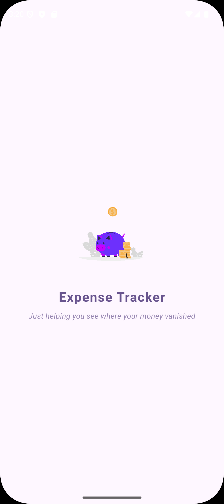
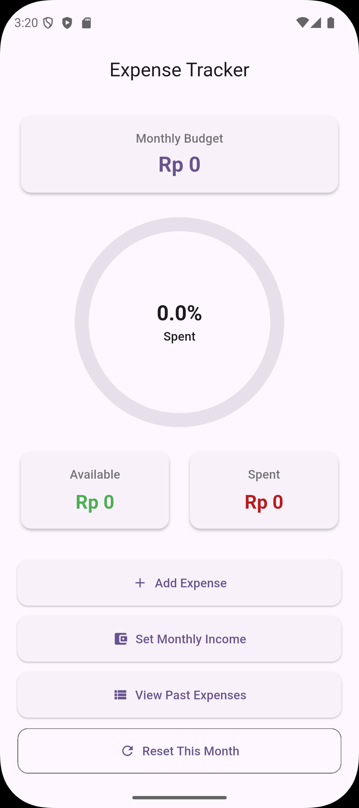
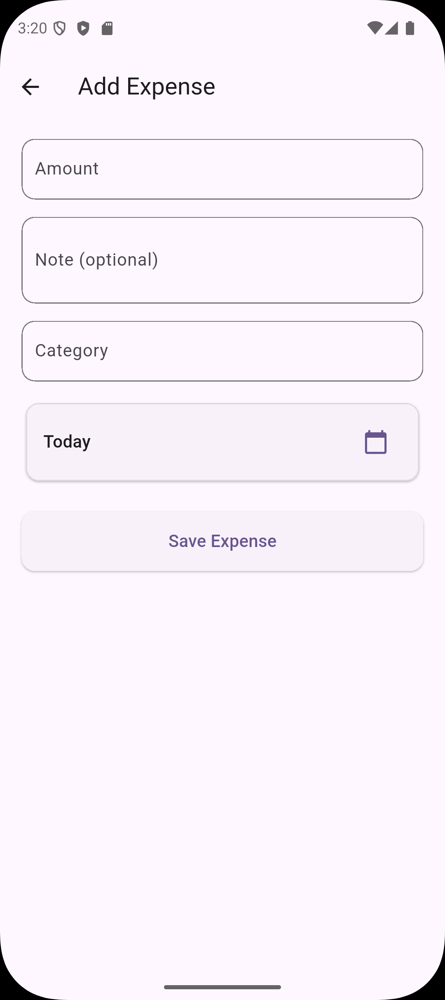
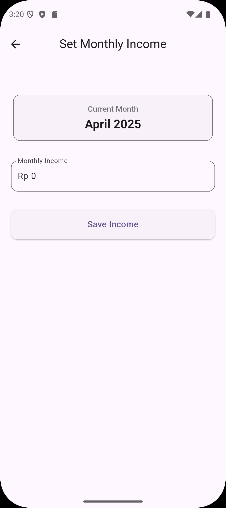
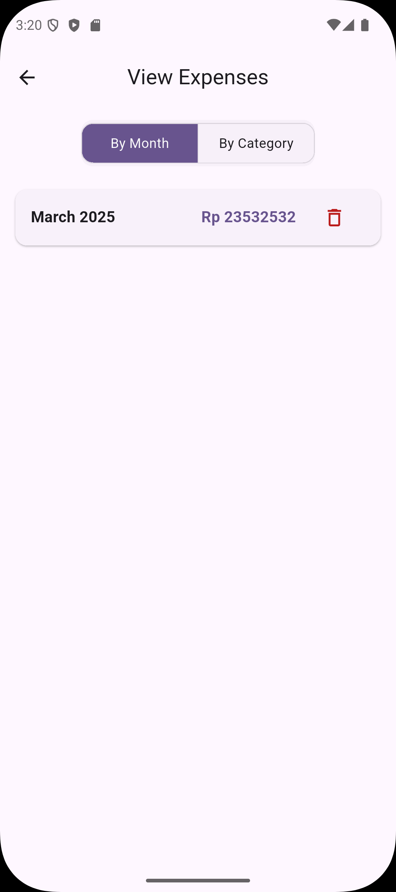
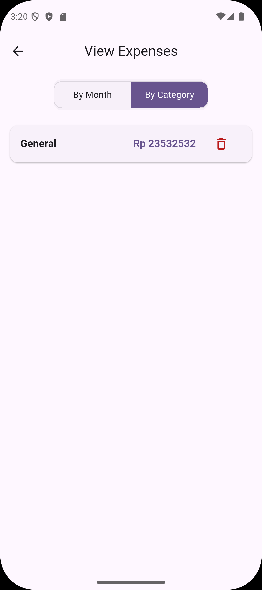
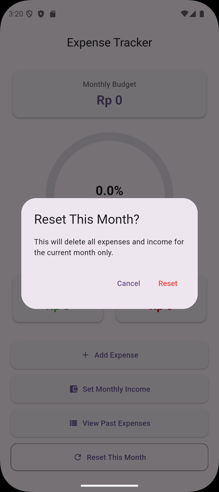

# Expense Tracker

**Expense Tracker** is a simple and user-friendly Flutter app designed to help users track and manage their expenses. It helps users set goals, view their monthly expenses, and visualize their spending. The app uses **Hive** for local storage and features a clean and intuitive UI.

---

## Features

- **Track Expenses**: Add, edit, and delete your expenses.
- **Monthly Overview**: View expenses for the current and past months.
- **Category Filtering**: Filter expenses by category or month.
- **Goal Setting**: Set and track monthly spending goals.
- **Spending Visualization**: View your expenses in a calendar or list format.

---

## Screenshots

Below are some screenshots of the app:


### 🏠 Splash Screen


### 📅 Home Page


### ➕ Add New Expense


### 📜 Set Income


### 📆 View Expenses - By Month


### 📊 View Expenses - By Category


### ⚙️ Reset Expense for the month



---

## Installation

To run this project locally on your machine, follow the instructions below:

### 1. Clone the Repository

```bash
git clone https://github.com/lucifer-140/Expense-Tracker.git
cd Expense-Tracker
```

### 2. Install Dependencies

Make sure you have [Flutter](https://flutter.dev/docs/get-started/install) installed on your machine.

Run the following command to install the required dependencies:

```bash
flutter pub get
```

### 3. Run the App

To launch the app, run the following command:

```bash
flutter run
```

The app will launch in the emulator or connected device.

---

## Usage

### Add an Expense

1. Tap the **Add Expense** button.
2. Fill in the details: name, category, amount, and date.
3. Tap **Save** to add the expense.

### View Expenses

You can view all your expenses in a list or calendar view. Expenses are automatically categorized and sorted by date.

### Set Goals

Set a **monthly spending goal** and track your progress throughout the month. This helps you stay within your budget.

---

## Contributing

1. Fork the repository.
2. Create a new branch for your feature or bug fix.
3. Make your changes.
4. Push to your forked repository.
5. Create a pull request with a detailed description of your changes.

---

## Acknowledgments

- This project uses the following libraries:
  - [Flutter](https://flutter.dev/)
  - [Hive](https://pub.dev/packages/hive)
  - [Lottie](https://pub.dev/packages/lottie)

---
`